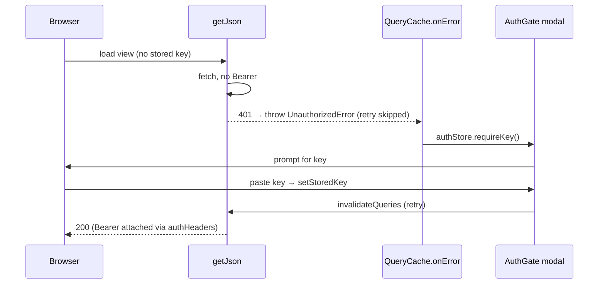

# Design: API Key Admin UI + Dashboard Self-Auth

## Technical Approach

Two coupled deliverables from proposal Approach A: (1) backend list/create/revoke routes under the already-gated `/api/` prefix, reusing existing domain + storage primitives; (2) client self-auth (localStorage + `Authorization: Bearer`) via a shared `authHeaders()` helper attached to **every** gated fetch — both `getJson()` and the Replay button's own raw `fetch` — with a global 401→key-entry modal. The SSE `EventSource` on `/api/telemetry/stream` is a **documented exception** (browsers cannot set headers on `EventSource`; see File Changes). No new backend auth concept, no schema change.

## Architecture Decisions

| Decision | Choice | Rejected | Rationale |
|---|---|---|---|
| Route file shape | Single `src/http/routes/keys.ts`, 3 handlers each wrapped in `withObservability`, re-exported and dispatched from `server.ts` (mirrors `telemetry/usage.ts`) | Per-handler folder like `telemetry/` | 3 small handlers; folder is overkill. `withObservability` is NOT silent for `/api/keys`, so create/revoke get a `requests` row attributed to the acting key's `api_key_id` → free "who did it" audit (explore Q6). |
| Create logic source | Reuse `generateKey()`+`hashKey()`+`insertApiKey()` verbatim (same sequence as `scripts/create-api-key.ts`) | Duplicate minting in the route | Zero new domain logic; one-time-secret contract preserved. Route SHOULD fail-fast 500 if `getApiKeyPepper()` is empty (mirrors CLI guardrail #1). |
| Hash-leak prevention | `listApiKeys()` SELECTs explicit columns, never `key_hash`; create handler returns an **explicit literal DTO**, never a spread of `ApiKeyRecord`/the DB row | `SELECT *` + strip; spreading the record into the response | Column allowlist + literal DTO make leaking `key_hash` structurally impossible even if a handler is careless. |
| Bearer attach point | Shared `authHeaders()` in `auth.ts`, applied in `getJson()` AND in `replay-button.tsx`'s raw `fetch`. Delete dead `replay()` from `api.ts` | Patch only `api.ts` | Spec requires EVERY gated fetch to carry Bearer. `api.ts`'s exported `replay()` has **zero callers** (grep-confirmed dead code) — patching it fixes nothing; the live Replay path is `replay-button.tsx`, which would otherwise keep 401ing forever. |
| 401 handling | `getJson()` throws typed `UnauthorizedError`; global `QueryCache({ onError })` in `main.tsx` flips an external auth store → `<AuthGate>` modal in `__root.tsx`. Global `retry` predicate skips retry for `UnauthorizedError` (others keep `retry:1`). Raw-fetch callers (Replay) call `authStore.requireKey()` on 401 directly | Per-route `errorComponent` 401 case; accept the default 1-retry delay | React Query async errors surface via `QueryCache`, not `errorComponent`. Default `retry:1` would otherwise delay the modal by one backoff on a genuine 401 → skip retry for `UnauthorizedError` so the prompt is immediate. Replay is outside react-query, so it triggers the store itself. |
| Revoke confirm UI | `Dialog` (confirm variant) | `AlertDialog` | `alert-dialog.tsx` is NOT installed in `components/ui/`; only `dialog.tsx` is. |
| Self-lockout identifier | Null-guarded compare: `const s = getStoredKey(); const selfLockout = s != null && row.prefix === parseKeyPrefix(s)` | Compare by `id`; call `parseKeyPrefix(getStoredKey())` unguarded | `getStoredKey()` can be `null` (`REQUIRE_API_KEY=false`, or before first entry). No stored key → nothing to lock out → skip warning, never call `parseKeyPrefix(null)`. Client can derive `prefix` but never `id`. `prefix` is indexed but not UNIQUE → ~1/2³² false-positive on the *warning* only; acceptable (safer failure direction). |

## Backend Contracts

`src/observability/storage.ts` (new):
```ts
// metadata-only; key_hash never selected
export function listApiKeys(): Array<Pick<ApiKeyRecord,"id"|"prefix"|"label"|"created_at"|"revoked_at">> {
  if (!db) return [];
  return db.query(`SELECT id, prefix, label, created_at, revoked_at
                   FROM api_keys ORDER BY created_at DESC`).all();
}
// idempotent soft-revoke; true iff a row transitioned active→revoked
export function revokeApiKey(id: number): boolean {
  if (!db) return false;
  const res = db.prepare(`UPDATE api_keys SET revoked_at = ?
                          WHERE id = ? AND revoked_at IS NULL`)
                .run(new Date().toISOString(), id);
  return res.changes > 0;
}
```
Add a metadata DTO type (`ApiKeyMeta`) to `types.ts` so handlers can't touch `key_hash`.

Routes (`/api/*`, inherit `enforceApiKey` free):
- `GET /api/keys` → `{ keys: ApiKeyMeta[] }`
- `POST /api/keys` `{label}` → `201 { id, prefix, label, created_at, full }` — **explicit literal DTO**, assembled field-by-field (`prefix`/`full` from `generateKey()`, `label` from the request, `id`/`created_at` from the insert result). The handler MUST NOT spread `ApiKeyRecord`/the DB row (carries `key_hash`). `full` is the plaintext, shown once.
- `POST /api/keys/:id/revoke` → `{revoked: boolean}` (idempotent; `:id` via regex `^/api/keys/[^/]+/revoke$`)

## Frontend Architecture

- New `src/ui/src/lib/auth.ts`: `getStoredKey/setStoredKey/clearStoredKey` (localStorage `cpk_dashboard_key`); `authHeaders(): Record<string,string>` = `{ Authorization: "Bearer "+key }` when a key exists, else `{}`; pure `parseKeyPrefix(full: string)` = `full.split(".")[0]`; a minimal external store (`subscribe/getSnapshot/requireKey/dismiss`) consumed via `useSyncExternalStore`.
- `src/ui/src/lib/api.ts` (surgical): `getJson()` merges `...authHeaders()`; on `res.status===401` throw `new UnauthorizedError()`. **Delete the dead `replay()`** (zero callers) to remove the misleading duplicate that masked the real Replay path.
- `src/ui/src/components/transcript/replay-button.tsx` (surgical): merge `...authHeaders()` into its `fetch("/v1/chat/completions", …)` headers; on `res.status===401`, call `authStore.requireKey()` (its existing error/toast path stays) so the raw-fetch 401 still surfaces the key-entry modal.
- New `src/ui/src/routes/keys.tsx` (mirrors `sessions.tsx`): TanStack Query list → `Table`; create via `Dialog`+`Input`+`Label`, success shows `full` once with reused `CopyButton`; revoke via confirm `Dialog` with the null-guarded self-lockout warning above; `errorComponent: RouteError`. Refetch via `queryClient.invalidateQueries(["keys"])` after create/revoke.
- `<AuthGate>` mounted in `__root.tsx` renders the key-entry `Dialog` when the auth store is active; on submit → `setStoredKey` → `queryClient.invalidateQueries()`.
- New nav entry `{ to:"/keys", label:"Keys", icon: KeyRoundIcon }` in `app-header.tsx` `NAV`.

## Data Flow



## File Changes

| File | Action | Description |
|---|---|---|
| `src/observability/storage.ts` | Modify | Add `listApiKeys()`, `revokeApiKey(id)` |
| `src/observability/types.ts` | Modify | Add `ApiKeyMeta` DTO |
| `src/http/routes/keys.ts` | Create | 3 handlers (list/create/revoke); create returns explicit literal DTO |
| `src/http/server.ts` | Modify | Import + dispatch 3 routes after telemetry block (insert at line 84) |
| `src/ui/src/lib/auth.ts` | Create | key storage, `authHeaders()`, `parseKeyPrefix`, auth store |
| `src/ui/src/lib/api.ts` | Modify | `getJson()` Bearer via `authHeaders()` + `UnauthorizedError` on 401; **delete dead `replay()`** |
| `src/ui/src/components/transcript/replay-button.tsx` | Modify | Attach `...authHeaders()` to its raw `fetch`; on 401 call `authStore.requireKey()` |
| `src/ui/src/main.tsx` | Modify | `QueryCache({onError})` wiring + `retry` predicate skipping `UnauthorizedError` |
| `src/ui/src/routes/__root.tsx` | Modify | Mount `<AuthGate>` |
| `src/ui/src/routes/keys.tsx` | Create | List/create/revoke page (null-guarded self-lockout warning) |
| `src/ui/src/components/layout/app-header.tsx` | Modify | `Keys` NAV entry |
| `src/ui/src/hooks/useEventStream.ts` | **Out (documented)** | `EventSource` on gated `/api/telemetry/stream` cannot carry an `Authorization` header (browser API limitation) → the Live view stays 401 under `REQUIRE_API_KEY=true`. Deferred, NOT silently: a correct fix needs a query-param/short-lived stream token accepted by the stream route (backend change, security-sensitive — keys in URLs get logged), out of this slice. Fails soft (useEventStream's `onerror` backoff-reconnects; no crash), unlike the other views. Same-class bypass as Replay, called out here so it is not a hidden gap. |

## Testing Strategy

| Layer | What | Approach |
|---|---|---|
| Unit (backend) | `listApiKeys` (excludes `key_hash`, DESC order), `revokeApiKey` (idempotent: 2nd call `false`, unknown id `false`) | Extend `__tests__/api-key-storage.spec.ts`, `:memory:` DB |
| Route (backend) | list/create/revoke shapes; 201 `full`; **negative: create response JSON has NO `key_hash` key**; create fail-fast on empty pepper | New `__tests__/keys-route.spec.ts` — `spyOn(storage)` + `Request`, mirrors `telemetry-usage-route.spec.ts` |
| Dispatch (backend) | `/api/keys*` 401 without key | Extend `__tests__/api-key-dispatch.spec.ts` |
| Unit (frontend, pure) | `parseKeyPrefix`; `authHeaders` (empty `{}` when no key, `Bearer` when present); self-lockout compare **including null-stored → no warning** | New `__tests__/ui-auth.spec.ts` — imports pure fns from `auth.ts` (no DOM); satisfies `strict_tdd` |
| Components / DOM | modal, table, dialogs, Replay-button 401→modal, Live-view stream gap | **Manual verification only** — see decision below; sdd-tasks MUST make this an explicit checkable task, not a footnote |

**Frontend-testing decision (explicit):** This repo has ZERO frontend tests and NO DOM test infra (no happy-dom/jsdom/RTL). This change introduces the **first frontend test** but ONLY for DOM-free pure logic (`parseKeyPrefix`, `authHeaders`, lockout compare) via existing `bun:test`, honoring `strict_tdd`. React components + localStorage-bound wrappers are **scoped OUT of automated testing** because standing up a DOM env + RTL is infra out of this slice; they are covered by manual build+deploy+browser verification. Deliberate scope boundary, not a silent skip.

## Security Note

"Any valid key mints/revokes keys" (proposal Decision #2, accepted v1) has a sharper edge than lockout: revoking a *compromised* key does NOT evict an attacker who already self-minted replacement keys through `POST /api/keys`. Because `/api/keys` is NOT a silent path, every create/revoke writes a `requests` row attributed via `api_key_id` — that attribution is the forensic signal an operator MUST check (which key minted which) after any suspected compromise, and the basis for a future bulk-revoke/`is_admin` follow-up.

## Rollback

Revert the listed files. Backend: `enforceApiKey`, `api_keys` schema, and all prior functions are untouched (only additive functions/routes) — no migration, no data change. Revoke writes only `revoked_at` (soft, additive). Reverting the UI edits restores the pre-change dashboard exactly; deleting `keys.tsx`/`auth.ts` and the NAV entry removes the new surface with no residue. Gate the revert with `bun test` (backend, repo root) and `cd src/ui && bun run typecheck` (the real UI script: `tsr generate && tsc --noEmit`) — root `package.json` has NO `tsc` script, so do not cite `bun run tsc` at the root.

## Open Questions

- [ ] None blocking. Privilege model (any valid key manages keys) accepted for v1 per proposal Decision #2. Live-view SSE auth (query-param/stream token) deferred and documented above.
