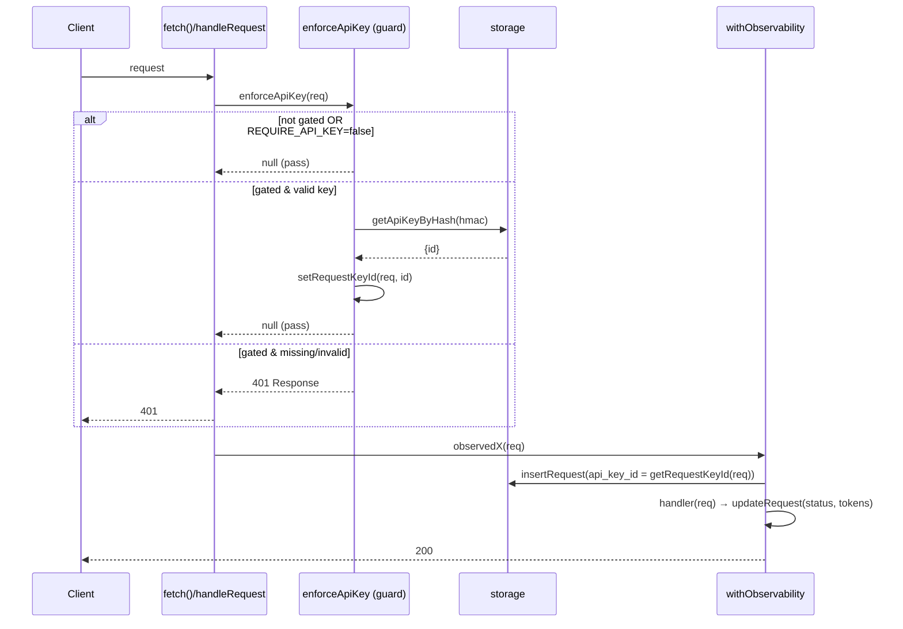

# Design: API-Key Authentication

## Technical Approach

Insert a **pre-dispatch guard** in `server.ts` `fetch()` that gates `/v1/*` and
`/api/*` (incl. telemetry) behind a fast HMAC-SHA256 key check; `/health`,
`/assets/*`, `/`, and the SPA fallback bypass it. Validation reads
`Authorization: Bearer` / `X-API-Key`, HMACs the key with a server pepper, and
looks up an indexed `key_hash` in a new `api_keys` table. A valid request is
attributed to `requests.api_key_id` via a per-`Request` `WeakMap` that
`withObservability` reads when it builds `insertRequest`. Enforcement stays off
until `REQUIRE_API_KEY=true`. All Bun-native (`Bun.CryptoHasher`, `bun:sqlite`).

## Architecture Decisions

| # | Options | Decision + Rationale |
|---|---------|----------------------|
| 1 Hook point | pre-dispatch guard vs. fold into `withObservability` | **Pre-dispatch `enforceApiKey(req)` as first stmt in the `fetch()` try-block.** SRP (auth ≠ observability); 401 short-circuits *before* any `insertRequest` row; telemetry stays gated even though `withObservability`'s `SILENT_PATH_PREFIXES=["/api/telemetry"]` skips its *logging* — the two concerns stay orthogonal; existing handler-level tests (which bypass `fetch()`) stay green. |
| 2 Gated predicate | reuse `isApiOwned` vs. explicit | **`pathname.startsWith("/v1/") \|\| startsWith("/api/")`.** NOT `isApiOwned` (that includes `/assets/`+`/health`). So `/health`, `/assets/*`, `/`, SPA truly bypass; every JSON/data route is covered. |
| 3 Hashing | `Bun.password` vs. fast hash | **`HMAC-SHA256(pepper, fullKey)` hex, unique-indexed.** Per-request check must be sub-ms; bcrypt/argon2 (~50-100ms) is a latency regression. Pepper = `API_KEY_PEPPER`; rotating it invalidates all keys (kill switch). |
| 4 Key format | plain vs. prefixed | **`cpk_<prefix>.<secret>` shown once**; store `prefix` (plaintext, indexed) + `key_hash` only. Stripe/GitHub-style display handle, secret never persisted. |
| 5 Attribution transport | header mutation vs. context | **Module-level `WeakMap<Request, number>` in domain; guard `set`, middleware `get`.** Same `req` identity flows `fetch → observedX → withObservability`; no header mutation, GC-safe. |
| 6 Config access | import-time const vs. call-time | **`isApiKeyRequired()` / `getApiKeyPepper()` read `Bun.env` at call-time**, mirroring existing `isClaudeCodeIdentityEnabled()`. Tests flip enforcement without re-import; startup fails fast if required && empty pepper. |
| 7 Schema | normalized vs. denormalized | **`api_keys` table + advisory `requests.api_key_id`** (no `PRAGMA foreign_keys=ON`). Label/rotation lives once; app writes only validated ids → no orphans. |
| 8 Testability | port bind vs. exported handler | **Extract exported `handleRequest(req)`; `startServer()` uses `{ fetch: handleRequest }`.** Optional `initStorage(dbPath?)`. Enables the first real dispatch-level integration test + deterministic storage tests. |

## Data Flow



## Schema

```sql
CREATE TABLE IF NOT EXISTS api_keys (
  id INTEGER PRIMARY KEY AUTOINCREMENT,
  prefix TEXT NOT NULL,
  key_hash TEXT NOT NULL UNIQUE,      -- HMAC-SHA256(pepper, full), hex
  label TEXT NOT NULL,
  created_at TEXT NOT NULL,
  revoked_at TEXT                     -- NULL = active
);
CREATE INDEX IF NOT EXISTS idx_api_keys_prefix ON api_keys(prefix);
-- inside initStorage(), reusing the existing pattern:
ensureColumn("requests", "api_key_id", "INTEGER");
CREATE INDEX IF NOT EXISTS idx_requests_api_key ON requests(api_key_id);
```

## Interfaces / Contracts

- `domain/api-keys.ts`: `generateKey() → {prefix,secret,full}`; `hashKey(full) →
  hex` (`new Bun.CryptoHasher("sha256", getApiKeyPepper()).update(full).digest("hex")`);
  `parseKeyFromHeaders(req)` (Bearer, then X-API-Key); `setRequestKeyId(req,id)` /
  `getRequestKeyId(req)`.
- `guards/api-key.ts`: `enforceApiKey(req): Response | null` — 401 `Response` or
  `null` (pass); `emit("warn","auth.rejected",{path})` on reject.
- `storage.ts`: `insertApiKey(rec)`, `getApiKeyByHash(hash)` (`WHERE key_hash=? AND
  revoked_at IS NULL`), `getUsageByApiKey({timeFrom?,timeTo?})` — mirrors
  `getMetrics()` `SUM(...)` with `GROUP BY api_key_id` + `LEFT JOIN api_keys`.
- Route `GET /api/telemetry/usage?timeFrom&timeTo` → `{generated_at, time_from,
  time_to, keys:[{api_key_id,prefix,label,requests,tokens_in,tokens_out,
  cache_read_tokens,cache_creation_tokens}]}`; wrapped with `withObservability`.

## File Changes

| File | Action | Description |
|------|--------|-------------|
| `src/domain/api-keys.ts` | Create | generate/hash/parse + request→keyId WeakMap (pure) |
| `src/guards/api-key.ts` | Create | `enforceApiKey` gate (anti-loop.ts convention) |
| `scripts/create-api-key.ts` | Create | CLI: generate+hash+`insertApiKey`, print secret once |
| `src/http/routes/telemetry/usage.ts` | Create | usage-by-key handler |
| `src/http/server.ts` | Modify | export `handleRequest`; wire guard; add `/api/telemetry/usage` |
| `src/observability/storage.ts` | Modify | `api_keys` + `api_key_id`; new fns; `api_key_id` in insertRequest; opt `initStorage(dbPath?)` |
| `src/observability/middleware.ts` | Modify | `api_key_id: getRequestKeyId(req)` in insertRequest record |
| `src/observability/types.ts` | Modify | `RequestRecord.api_key_id?`; `ApiKeyRecord`, `UsageByKey` |
| `src/config.ts` | Modify | `isApiKeyRequired()`, `getApiKeyPepper()` (call-time env) |
| `src/http/routes/telemetry/index.ts` | Modify | export `handleTelemetryUsage` |
| `README.md` | Modify | issue/use a key; supersede "not a replacement for a real API key" line |

## Testing Strategy

| Layer | What | Approach |
|-------|------|----------|
| Unit — domain | key format, `hashKey` determinism + pepper sensitivity, header parse (Bearer/X-API-Key/missing), WeakMap set/get | `bun:test`, pure calls; set `Bun.env.API_KEY_PEPPER` |
| Unit — guard | exempt→null; gated missing/invalid→401; gated valid→null+attributed | `spyOn(storage,"getApiKeyByHash")`; toggle `Bun.env.REQUIRE_API_KEY` |
| Integration — **dispatch (first of its kind)** | import exported `handleRequest`; `REQUIRE_API_KEY=true`: `/v1/chat/completions` no key→**401**, `/health` no key→200, `/api/telemetry/metrics` no key→**401** (proves telemetry gated), valid key→200 + `insertRequest` called with `api_key_id`; `REQUIRE_API_KEY=false`: no key→pass | real `Request` objects through exported handler; `spyOn` getApiKeyByHash + upstream `fetch` + `insertRequest` |
| Unit — storage | `getUsageByApiKey` totals for a timeFrom/timeTo window | seed rows via `initStorage(":memory:")` + `insertRequest` |

## Migration / Rollout

`REQUIRE_API_KEY=false` default = grace period; existing callers unaffected.
Seed keys with `bun scripts/create-api-key.ts <label>`, then flip
`REQUIRE_API_KEY=true`. Startup throws if `true` && empty `API_KEY_PEPPER`.
Schema is additive/idempotent (`IF NOT EXISTS` / `ensureColumn`).

## Rollback

- `REQUIRE_API_KEY=false` → `enforceApiKey` returns `null` for all → enforcement off instantly, no redeploy.
- Guard wiring is one added block in `fetch()`; revert that commit to remove the gate. `handleRequest` extraction is behavior-preserving.
- `api_keys` table + `requests.api_key_id` are additive (`IF NOT EXISTS`/`ensureColumn`) — safe to leave; old rows keep NULL `api_key_id`; no data loss.
- New files (`domain/api-keys.ts`, `guards/api-key.ts`, `create-api-key.ts`, `usage.ts`) + the `telemetry/index.ts` export line are self-contained; deleting them has no runtime impact.

## Open Questions

None blocking. (Advisory FK, BIND_HOST/network exposure, dashboard-session auth, and quotas remain explicit out-of-scope follow-ups per the proposal.)
