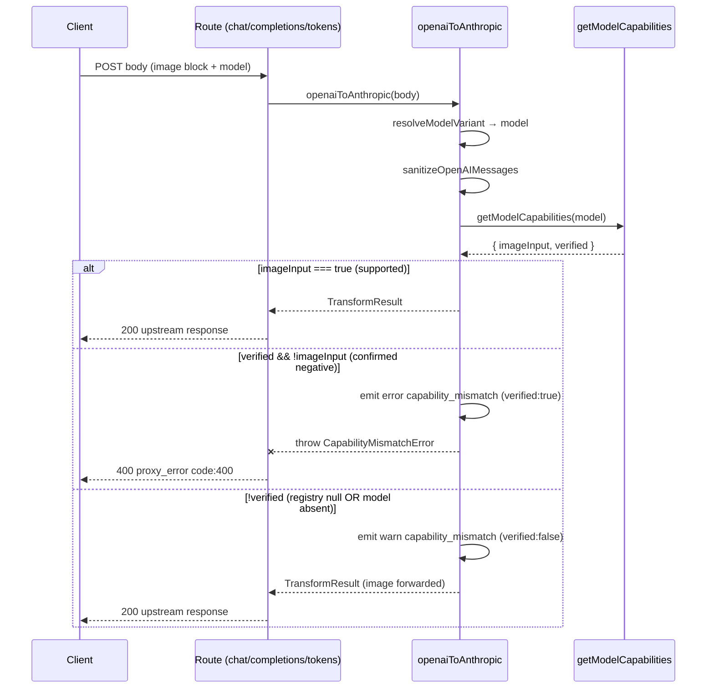

# Design: Vision Capability Gate (Issue #40)

## Technical Approach

One choke point inside `openaiToAnthropic()`. `model` is already resolved first (line 352, `resolveModelVariant`), so we add a single guard — `assertImageCapability(model, sanitizedMessages)` — immediately after `sanitizeOpenAIMessages` (line 378) and before the translation loop (line 380). The guard reads `getModelCapabilities(model)`, now carrying `imageInput` + `verified`, and enforces a tri-state: **pass** when the model supports vision, **hard-reject** when a live registry confirms it does not AND an image block is present, **fail-open + warn** when unverified. Rejection is a typed `CapabilityMismatchError`; the 3 route handlers catch it and map to `proxy_error` 400 (`code:400`), mirroring the anti-loop guard at `chat.ts:53-63`. `toAnthropicContentBlocks()` stays a pure, signature-stable helper — untouched.

## Architecture Decisions

| Decision | Choice | Alternatives rejected | Rationale |
|---|---|---|---|
| Provenance signal | Add `verified: boolean` to `ModelCapabilities`, computed in `getModelCapabilities()` from a single read of module `registry` | `source:"live"\|"fallback"` string; separate `registryHasModel()`/`isRegistryLive()` helper | `verified` is the exact predicate the gate needs and maps 1:1 to the observability payload. A single returned object is a **consistent snapshot** — a second helper call could desync if `refreshRegistry()` swaps `registry` mid-request. A `source` string can't cleanly encode "model absent from a live registry". |
| Error type location | `CapabilityMismatchError` in `src/transform/openai-to-anthropic.ts`, exported | `src/domain/`, dedicated `errors.ts` | Mirrors the codebase's own precedent: `CountTokensError` lives with `countTokens` and is co-imported (`tokens.ts:12`). All 3 routes already import from this module — zero new graph edge. |
| Throw placement | Guard runs after `sanitizeOpenAIMessages` (line ~379), before the loop; only when an image block is present | Thread `model` into `toAnthropicContentBlocks()`; check at line 588 | Keeps the pure helper pure (exploration flagged threading as a breaking change). Line 588's `caps` stays untouched (minimal blast radius); a second sync map lookup is negligible. Image-presence fast path means text-only requests never trip the gate. |
| Event | Reuse `transform.image_block_dropped`, reason `capability_mismatch`, add `model` + `verified` | New event name | Continuity with existing dashboards (Decision 6). Naming caveat accepted: fail-open forwards the image (nothing dropped), but the event is retained for observability parity. |
| Kill-switch | Optional `VISION_CAPABILITY_GATE` env → force global fail-open | none | Staged-rollout safety valve; see Migration. |

## Data Flow

```
Client ──image block──▶ Route ──▶ openaiToAnthropic()
                                       │ resolveModelVariant → model
                                       │ sanitizeOpenAIMessages
                                       ▼
                              assertImageCapability(model, msgs)
                        ┌──────────────┼───────────────────────┐
             imageInput=true    verified && !imageInput     !verified
              (pass/forward)     (throw → 400)          (warn + forward)
```

### Sequence



## File Changes

| File | Action | Description |
|---|---|---|
| `src/domain/models.ts` | Modify | Add `imageInput` + `verified` to `ModelCapabilities` (20-24), `DEFAULT_CAPABILITIES` (86-90), and `getModelCapabilities()` (164-172). |
| `src/transform/openai-to-anthropic.ts` | Modify | Export `CapabilityMismatchError`; add `messagesContainImage()` + `assertImageCapability()`; call guard at line ~379. |
| `src/http/routes/chat.ts` | Modify | Wrap `openaiToAnthropic(body)` (line 68) in try/catch → `proxy_error` 400. |
| `src/http/routes/completions.ts` | Modify | Wrap call (line 206) in try/catch (inert for FIM string content). |
| `src/http/routes/tokens.ts` | Modify | Wrap call (line 37) in try/catch → `proxy_error` 400. |
| `__tests__/transform-model-capabilities.spec.ts` | Modify | Assert new shape + tri-state gate. |
| `__tests__/transform-image-blocks.spec.ts` | Modify | Reject / fail-open / pass e2e. |

## Interfaces / Contracts

```typescript
// src/domain/models.ts
export interface ModelCapabilities {
  adaptiveThinking: boolean;
  contextManagement: boolean;
  outputEffort: boolean;
  imageInput: boolean;   // NEW — from UpstreamModel.imageInput
  verified: boolean;     // NEW — true iff read from a LIVE registry entry
}

export function getModelCapabilities(model: string): ModelCapabilities {
  const live = registry !== null;                 // module-level registry
  const entry = indexById(currentCatalog()).get(model);
  if (!entry) return DEFAULT_CAPABILITIES;        // imageInput:false, verified:false
  return {
    adaptiveThinking: entry.adaptiveThinking,
    contextManagement: entry.contextManagement,
    outputEffort: entry.outputEffort,
    imageInput: entry.imageInput,
    verified: live,
  };
}
```

```typescript
// src/transform/openai-to-anthropic.ts
export class CapabilityMismatchError extends Error {
  constructor(readonly model: string, readonly reason = "image_input_unsupported") {
    super(`Model ${model} does not support image input`);
    this.name = "CapabilityMismatchError";
  }
}

const IMAGE_TYPES = new Set(["image_url", "input_image", "image"]);

function assertImageCapability(model: string, msgs: Array<Record<string, unknown>>): void {
  const hasImage = msgs.some((m) => Array.isArray(m.content) &&
    (m.content as Array<Record<string, unknown>>).some((b) => IMAGE_TYPES.has(b.type as string)));
  if (!hasImage) return;                          // fast path: no image, no gate
  const { imageInput, verified } = getModelCapabilities(model);
  if (imageInput) return;                         // vision-capable → pass
  emit(verified ? "error" : "warn", "transform.image_block_dropped",
    { reason: "capability_mismatch", urlPrefix: "", model, verified });
  if (verified) throw new CapabilityMismatchError(model);  // confirmed negative → reject
}
```

```typescript
// route catch (chat.ts:68; same shape in completions.ts:206, tokens.ts:37)
let transformed: TransformResult;
try { transformed = openaiToAnthropic(body); }
catch (err) {
  if (err instanceof CapabilityMismatchError) {
    emit("error", "chat.capabilityMismatch", { model: err.model, reason: err.reason });
    return Response.json({ error: {
      message: `Model ${err.model} does not support image input.`,
      type: "proxy_error", code: 400,
    }}, { status: 400 });
  }
  throw err;
}
```

## Testing Strategy

| Layer | What to Test | Approach |
|---|---|---|
| Unit | `getModelCapabilities` returns `imageInput`+`verified`; `DEFAULT_CAPABILITIES` shape | Direct assertions (REQ-7 pattern) |
| Unit | Tri-state gate: live+`imageInput:false`+image → throw; live+`imageInput:true` → pass; `registry===null` → fail-open+warn; model absent → fail-open | `__seedRegistryForTests()` + `spyOn(logger,"emit")` in `transform-model-capabilities.spec.ts` |
| Integration | 3 routes catch `CapabilityMismatchError` → `proxy_error` 400 `code:400`; FIM route inert | Route handlers with seeded registry, `bun:test` |
| Regression | Existing 22 `openaiToAnthropic()` callers/tests stay green | Full `bun test` run |

No `express`/`jest`/`vitest` — `bun:test` + existing test-only exports only.

## Threat Matrix

N/A — no routing, shell, subprocess, VCS/PR automation, executable-file classification, or process-integration boundary. The change gates a data field inside an existing transform and returns a structured 400; it adds no new external command or dispatch surface.

## Migration / Rollout

No data migration, schema, or persisted state — additive and isolated. Reject fires **only** in the new confirmed-negative + image-present state, so no previously-passing request changes. Optional staged rollout: `VISION_CAPABILITY_GATE=off` env (config.ts, mirroring `isApiKeyRequired()`) forces global fail-open, letting the gate ship dark and enable after telemetry confirms no false positives. Rollback = revert the feature commit(s); transform reverts to pass-through.

## Open Questions

- [ ] None blocking. Fixing `makeFallback()`'s `imageInput:false` for vision-capable fallback models is deliberately OUT of scope (fail-open neutralizes it); revisit separately if the informational `GET /v1/models` accuracy matters.
