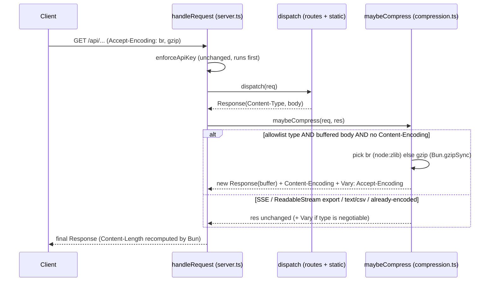

# Design: Dashboard Performance 2 — Payload, Compression & Query-Scale Hardening

## Technical Approach

Three delta capabilities (`http-compression`, `telemetry-list-projection`, `telemetry-query-scaling`) covering all 8 audit findings. Strategy: cut bytes-over-wire and per-poll/render cost with **no observable data change**, using only Bun-native / zero-dependency runtime builtins (`Bun.gzipSync`, `node:zlib.brotliCompressSync`, `bun:sqlite` FTS5). Every edit is behavior-preserving and independently revertible, phased for stacked-to-main PRs (proposal Phases 1–4).

The one non-obvious coupling the spec left open: **session grouping (`src/ui/src/lib/sessions.ts`) derives conversation identity from the request/upstream body text — the very fields we slim away.** So the slim projection must ship a server-derived `firstUserPreview`; this single decision unlocks both finding #1 (slim list) and finding #3 (session-detail overfetch).

## Architecture Decisions

| # | Question | Decision | Rejected alternative | Rationale |
|---|----------|----------|----------------------|-----------|
| 1 | Where compression lives; exclusion mechanism | Single tail gate `maybeCompress(req,res)` in `handleRequest` (new `src/http/compression.ts`); exclusion is **declarative**: compress only when Content-Type ∈ allowlist AND body is buffered (not `ReadableStream`) AND no existing `Content-Encoding` | Per-route middleware / per-handler opt-in flags | One chokepoint covers API JSON + static assets uniformly; SSE (`text/event-stream`), JSON-stream export (`ReadableStream` body) and CSV export (`text/csv` not allowlisted) are excluded by nature — no per-route bookkeeping to forget |
| 2 | Slim vs full shape; grouping verification | List endpoint slim by default, `?bodies=full` opt-in; **both** shapes add server-derived `firstUserPreview: string\|null`; `sessions.ts` reads `firstUserPreview` first, falls back to body parse. `firstUserPreview` computed **on-read** (parse of columns already loaded) | Stored `first_user_preview` column + backfill; or keep grouping-consumers on full bodies | On-read needs no schema/backfill/write-path change and the wire contract is identical to a future stored column, so it's a zero-cost upgrade later. Keeping consumers on full defeats #3. Verified by a parity test asserting `groupIntoConversations` yields identical group ids on slim vs full |
| 3 | Session-detail resolution | **Client cache restructuring, no new endpoint**: share one cached slim grouping query between `sessions.tsx` and `s.$sessionId.tsx`, drop `refetchInterval:10_000` (resolve once via `staleTime`), group on slim, fetch only the conversation's turns via existing by-id full endpoint | New `GET /api/telemetry/sessions/:id` lookup | No new server/auth/routing surface (out of scope); slim + `firstUserPreview` already makes the 500-row resolve tiny and one-shot; eliminates the 10s full-body poll entirely |
| 4 | Bounded percentiles (#4) + usage window (#5) | #4: cap the latency sample — `SELECT duration_ms … ORDER BY timestamp DESC LIMIT SAMPLE_CAP` then p50/p95/p99 in JS (bounds memory + sort cost; recent-biased, documented tolerance). #5: `getUsageByApiKey()` enforces a **default** `timeFrom = now − DEFAULT_WINDOW_MS` when caller supplies none | Reservoir sampling (#4); route-level window (#5) | Capped-recent is deterministic (no RNG → stable tests) and a near-trivial diff; enforcing the window in storage is a single chokepoint no caller can bypass into a full scan |
| 5 | FTS migration (#6) | Additive external-content FTS5: `CREATE VIRTUAL TABLE IF NOT EXISTS requests_fts USING fts5(request_body, response_body, content='requests', content_rowid='id')` + `AFTER INSERT/UPDATE/DELETE` triggers (IF NOT EXISTS) + one-time `rebuild` when empty; search path guarded by `ftsAvailable` flag, MATCH term sanitized (quoted phrase), **LIKE fallback** on missing index or MATCH throw | Contentless FTS (duplicates body TEXT); destructive rebuild | External-content avoids a second copy of huge bodies; all-additive and drop-safe (revert = drop vtable/triggers); FTS5 MATCH ≠ LIKE so sanitize + fallback keeps search crash-free |
| 6 | #7/#8 → new capability? | **Keep under `telemetry-query-scaling`** as scenarios | New `frontend-rendering` capability | Only two small impl-level tweaks (dynamic `import()` of Recharts on `/metrics`; `useMemo` around `prettyJson`); a new capability adds spec/tasks/archive overhead disproportionate to the change and they share the Phase-4 theme. Extract later only if frontend-rendering scope grows |

## Sequence: Compression Negotiation



## Sequence: Session-Detail Resolution (#3)

```mermaid
sequenceDiagram
  participant U as s.$sessionId.tsx
  participant Q as React Query cache
  participant L as GET /api/telemetry/requests (slim)
  participant B as GET /api/telemetry/requests/:id (full)
  U->>Q: useQuery ["requests","chat-slim"] (staleTime hi, NO refetchInterval)
  Q->>L: ?path=/v1/chat/completions&limit=500  (slim rows + firstUserPreview)
  L-->>Q: rows without body fields
  U->>U: groupIntoConversations(slim) → find id === sessionId
  U->>B: getRequest(traceId) × turns (parallel, full bodies)
  B-->>U: full transcript per turn
  Note over U,L: 10s × 500 full-body poll removed; resolve once + per-turn full
```

## File Changes

| File | Action | Description |
|------|--------|-------------|
| `src/http/compression.ts` | Create | `maybeCompress` gate: Accept-Encoding negotiation (br→gzip→identity), allowlist + buffered-body + no-encoding exclusion, sets `Content-Encoding`/`Vary` |
| `src/http/server.ts` | Modify | Extract route body into `dispatch(req)`; wrap single tail return with `maybeCompress`; `enforceApiKey`/OPTIONS unchanged and still first |
| `src/http/static.ts` | Unchanged | Asset responses pass through the central gate (deviation from proposal, which listed it Modified — no per-file change needed) |
| `src/http/routes/telemetry/export.ts`, `stream.ts` | Unchanged | Excluded by the gate (ReadableStream / `text/event-stream` / `text/csv`); guarded by RED tests |
| `src/http/routes/telemetry/requests.ts` | Modify | `toCamel(slim)` two-shape projection; parse `?bodies=full`; compute `firstUserPreview`; by-id endpoint stays full |
| `src/observability/conversation-preview.ts` | Create | Backend pure first-user-text extractor mirroring the UI heuristic (parse → first user msg → `\n\n` preamble split → cap 400) |
| `src/observability/storage.ts` | Modify | Capped percentile sample in `getMetrics`; default window in `getUsageByApiKey`; FTS5 vtable+triggers+rebuild in `initStorage`; `ftsAvailable` + FTS/LIKE branch in `buildRequestWhere` |
| `src/ui/src/lib/sessions.ts` | Modify | `firstUserTextFromRequest` prefers `record.firstUserPreview`, body parse as fallback |
| `src/ui/src/lib/types.ts` | Modify | `RequestRecord`: body fields optional + add `firstUserPreview?`; `RequestFilters`: add `bodies?: "full"` |
| `src/ui/src/lib/api.ts` | Modify | `listRequests` forwards `bodies` via `toQuery` (no signature change) |
| `src/ui/src/routes/s.$sessionId.tsx` | Modify | Shared slim cache key; remove `refetchInterval:10_000`; group on slim |
| `src/ui/src/routes/index.tsx`, `sessions.tsx` | Verify/Modify | Already default (now slim); confirm table + grouping render on slim shape |
| `src/ui/src/routes/metrics.tsx` | Modify | `lazy()` / dynamic `import()` Recharts chart subtree (#7) |
| `src/ui/src/components/panels/technical-panel.tsx` | Modify | `useMemo(() => prettyJson(body), [body])` per tab (#8) |

## Interfaces / Contracts

```ts
// GET /api/telemetry/requests?bodies=full   (default = slim)
// slim record: all current camelCase fields EXCEPT requestBody/responseBody/upstreamRequestBody
//              + firstUserPreview: string | null   (post-preamble, ≤400 chars, null for non-chat)
// full record (?bodies=full): current shape + firstUserPreview  (byte-superset)
// GET /api/telemetry/requests/:traceId  → ALWAYS full (transcript view)

interface RequestRecord {           // src/ui/src/lib/types.ts
  /* …unchanged metadata… */
  requestBody?: string | null        // now optional (absent in slim)
  responseBody?: string | null
  upstreamRequestBody?: string | null
  firstUserPreview?: string | null   // NEW — grouping + preview input
}

// storage.ts
getMetrics(windowMs?: number, sampleCap?: number): Metrics      // sample capped; shape unchanged
getUsageByApiKey(f?: { timeFrom?; timeTo?; defaultWindowMs? }): UsageByKey[]  // window enforced
// buildRequestWhere: when filters.search && ftsAvailable → JOIN requests_fts MATCH ?; else LIKE
```

## Testing Strategy

| Layer | What | Approach (bun:test) |
|-------|------|---------------------|
| Unit | `maybeCompress` eligibility: br/gzip pick, identity, exclusions | Call with crafted `Request`/`Response`; assert `Content-Encoding`/`Vary`; decode round-trips byte-identical |
| Unit | Slim projection omits 3 body fields, keeps metadata + `firstUserPreview` | Direct handler call + `fetch` mock over `queryRequests` |
| Unit | **Grouping parity** — slim rows group into same ids as full | Feed fixtures; assert `groupIntoConversations(slim)` ids == full ids (imports backend extractor + UI grouping) |
| Unit | Capped percentiles shape; windowed usage excludes out-of-window rows | `:memory:` DB seeded past `SAMPLE_CAP`/window bounds |
| Unit | FTS returns same logical matches; LIKE fallback when vtable dropped | `:memory:` DB with/without `requests_fts` |
| Integration | SSE keeps framing + no `Content-Encoding`; streaming/CSV export uncompressed | Drive `handleRequest` with real `Request`; assert headers + unbuffered body |
| Frontend | Recharts absent from non-`/metrics` initial chunk; `prettyJson` memoized | Dynamic-import assertion; `useMemo` referential-equality check |

## Threat Matrix

No shell, subprocess, VCS/PR automation, or executable-file classification is introduced.

| Boundary | Applicability | Design response |
|----------|---------------|-----------------|
| Documentation-like paths | N/A — no file classification/execution | — |
| Git repo selection / Commit / Push / PR commands | N/A — no VCS or process automation | — |
| Routing/response handling | Applicable (touches `handleRequest`) | `maybeCompress` runs AFTER `enforceApiKey` and route dispatch — cannot bypass auth or alter route matching; adds no new route. **Compression-oracle (BREACH): N/A** — telemetry responses are API-key-gated and never combine a secret with attacker-reflected input in one body. Never compress `text/event-stream` (correctness: preserves SSE framing). RED tests: auth-gate-before-compression, SSE-uncompressed |

## Migration / Rollout

FTS5 is additive and drop-safe (`CREATE … IF NOT EXISTS` + triggers + one-time `rebuild`; revert = drop vtable/triggers). No destructive schema change. `firstUserPreview` is derived on-read (no migration). Backend slim default + `firstUserPreview` and the UI grouping change **must ship in the same phase** so grouping never sees a body-less shape without a preview. Compression is header-only; revert removes the module + one wrap line. Per-phase independent PRs per the proposal rollback plan.

## Open Questions

- [ ] None blocking. All six spec-phase questions resolved above; the only forward-looking item is promoting `firstUserPreview` from on-read to a stored `first_user_preview` column if profiling shows read-parse cost matters (wire contract unchanged, so non-breaking).
